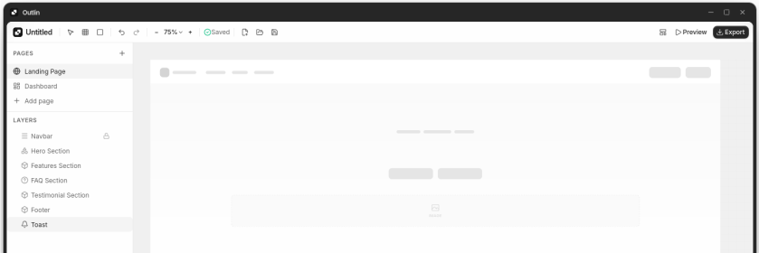

<p align="center">
  
</p>

<h1 align="center">Outlin</h1>

<p align="center">
  <b>Wireframe at the speed of thought.</b><br>
  A fast, local-first wireframing tool for modern interfaces — sketch,
  prototype and hand off product ideas before a single pixel is polished.
</p>

<p align="center">
  <a href="https://outlin.app">Website</a> ·
  <a href="https://outlin.app/demo">Live demo</a> ·
  <a href="https://outlin.app/download">Download</a> ·
  <a href="https://github.com/outlin/outlin/releases">Releases</a>
</p>

<p align="center">
  
  
  
</p>

---

## Features

- **Infinite canvas** with frames, layers and smart guides
- **Drag-and-drop UI library** — buttons, inputs, navbars, text blocks and more
- **Frames as containers** — drag elements in and out, auto-nested layers
- **Style inspector** — fills, borders, radius, shadows, typography
- **Multi-page projects** with preview (prototype) mode
- **PNG export**
- **Local-first** — projects are stored as `.outlin` files on your machine

## Repository layout

```
apps/app/         Tauri shell + editor entry page
  src-tauri/      Rust backend, window config, capabilities
packages/editor/  Shared editor: canvas, layers, inspector, UI kit
scripts/          release tooling
```

## Tech stack

- [Tauri 2](https://tauri.app) + Rust backend
- [Next.js](https://nextjs.org) 16 + React 19
- [Tailwind CSS](https://tailwindcss.com) v4 + [Base UI](https://base-ui.com)
- [pnpm](https://pnpm.io) workspaces

## Requirements

- Node.js 20+ and pnpm
- Rust (stable) with the [Tauri prerequisites](https://v2.tauri.app/start/prerequisites/). On Fedora:

  ```bash
  sudo dnf install webkit2gtk4.1-devel openssl-devel gcc gcc-c++ glib2-devel gtk3-devel libayatana-appindicator-gtk3-devel librsvg2-devel
  ```

## Development

```bash
pnpm install
pnpm dev        # runs the app with hot reload
```

## Build a release bundle

```bash
pnpm build      # produces .deb and .rpm bundles in apps/app/src-tauri/target/release/bundle/
```

## Contributing

See [CODE_OF_CONDUCT.md](CODE_OF_CONDUCT.md) and report vulnerabilities via
[SECURITY.md](SECURITY.md).

## License

[GNU Affero General Public License v3.0](LICENSE) — © 2026 Outlin.
