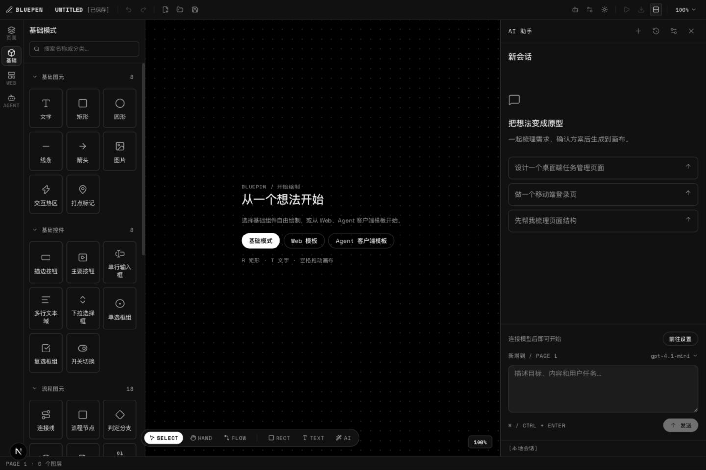
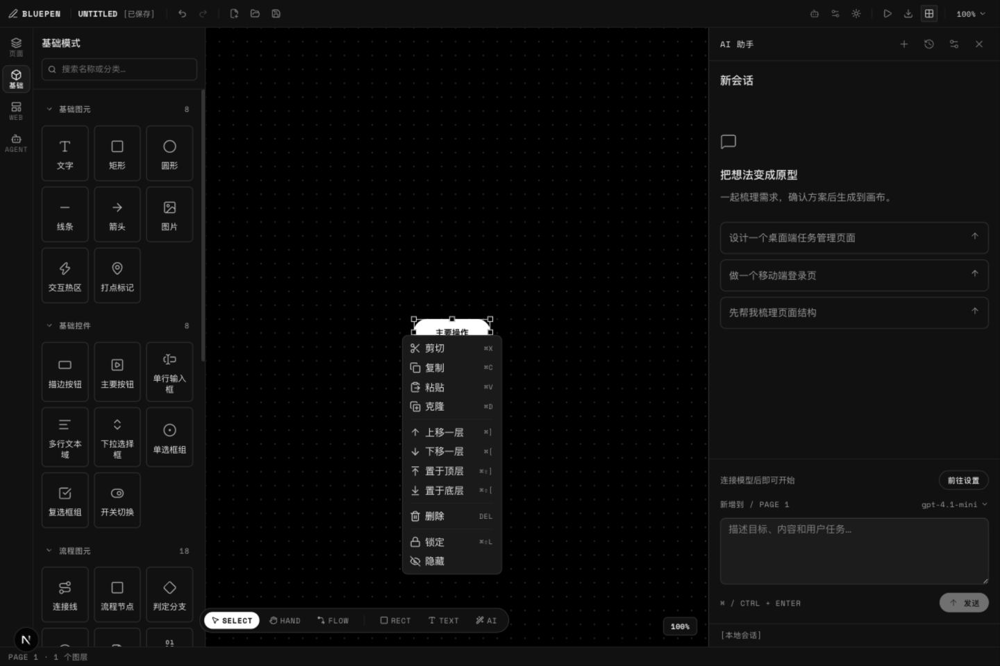
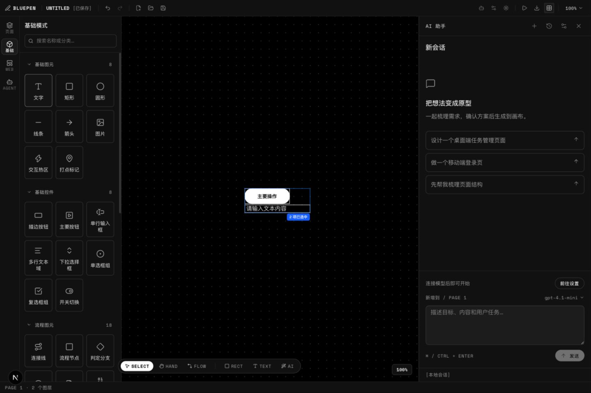
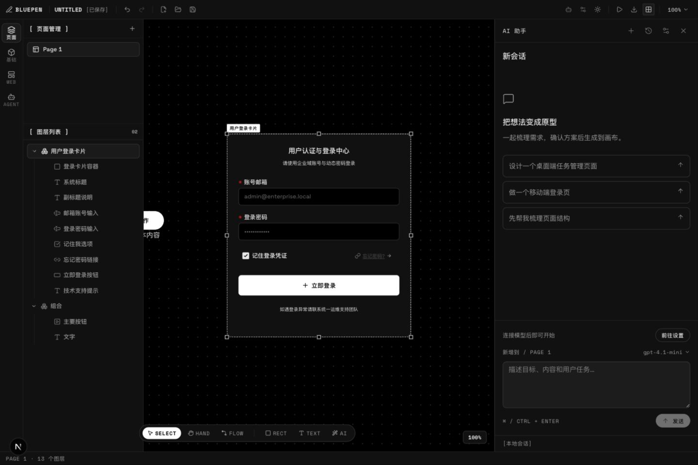
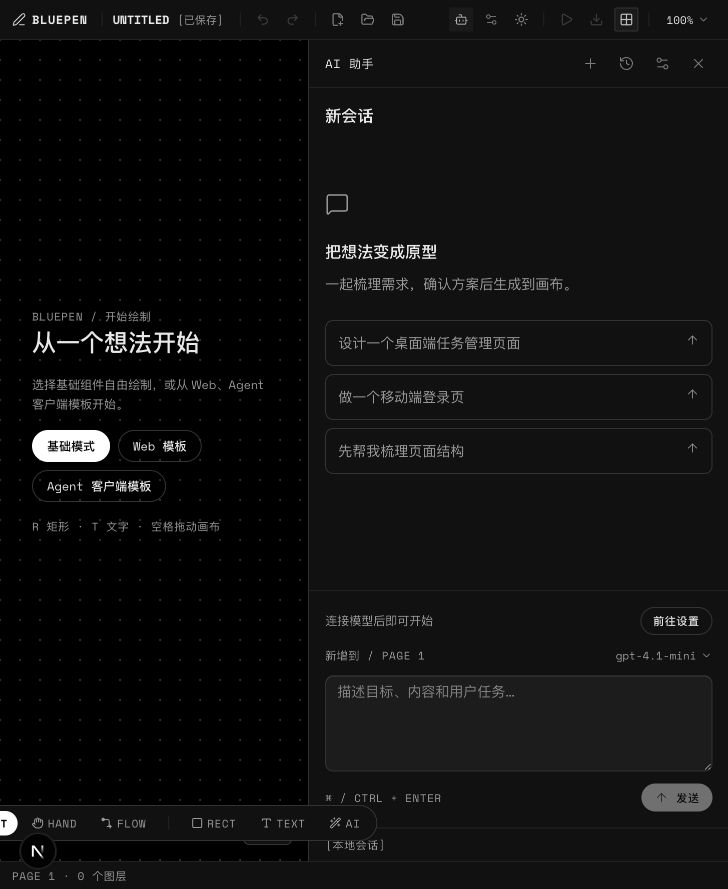
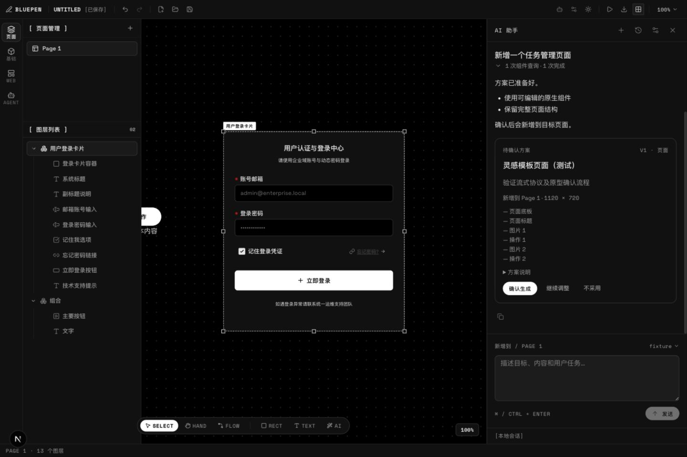
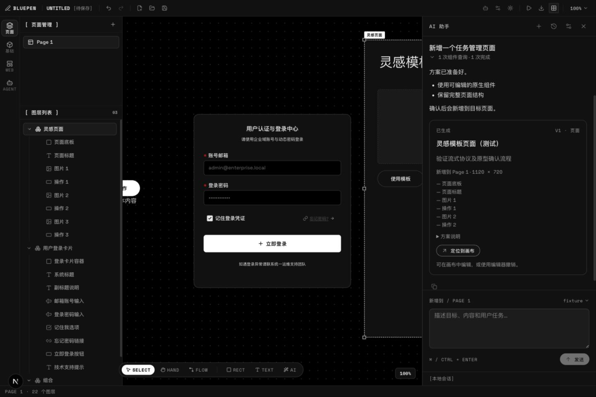
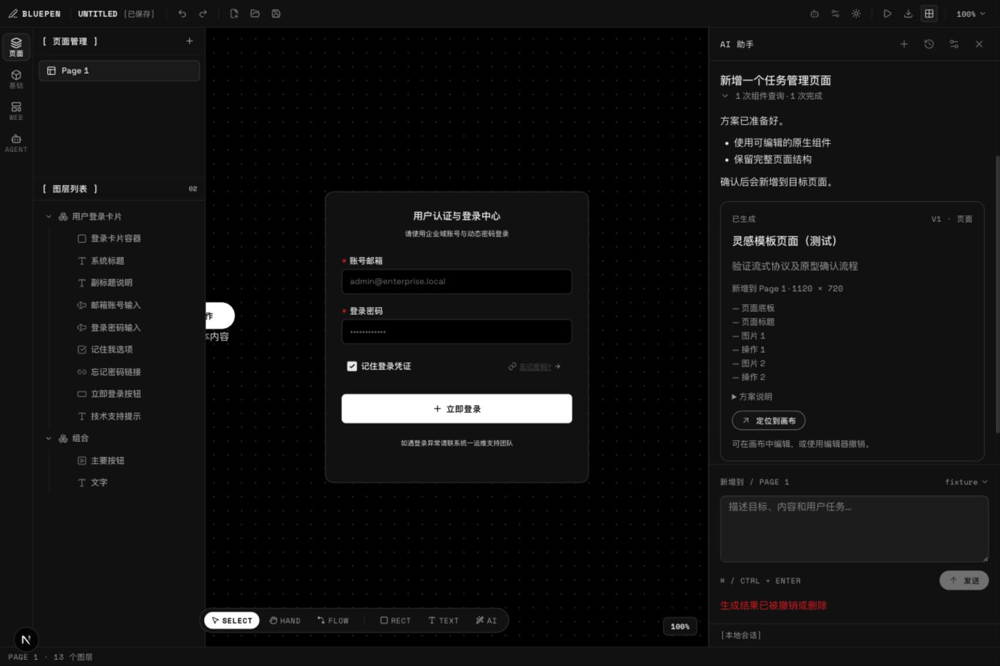
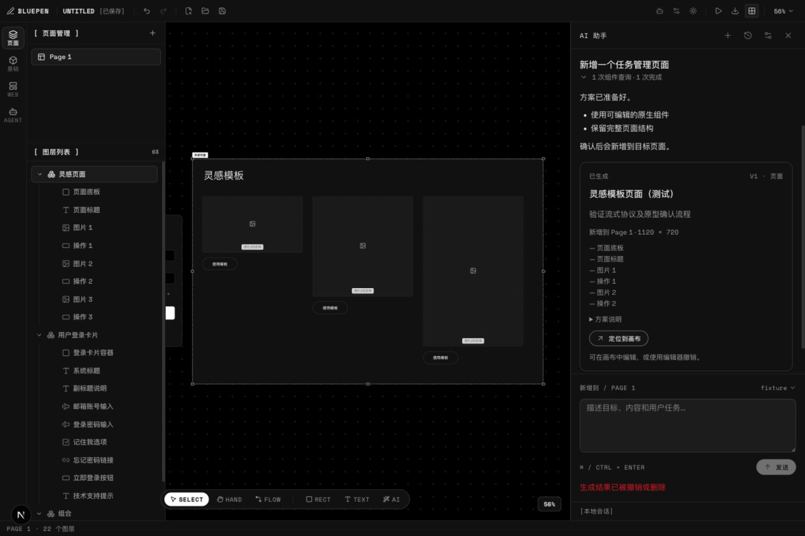
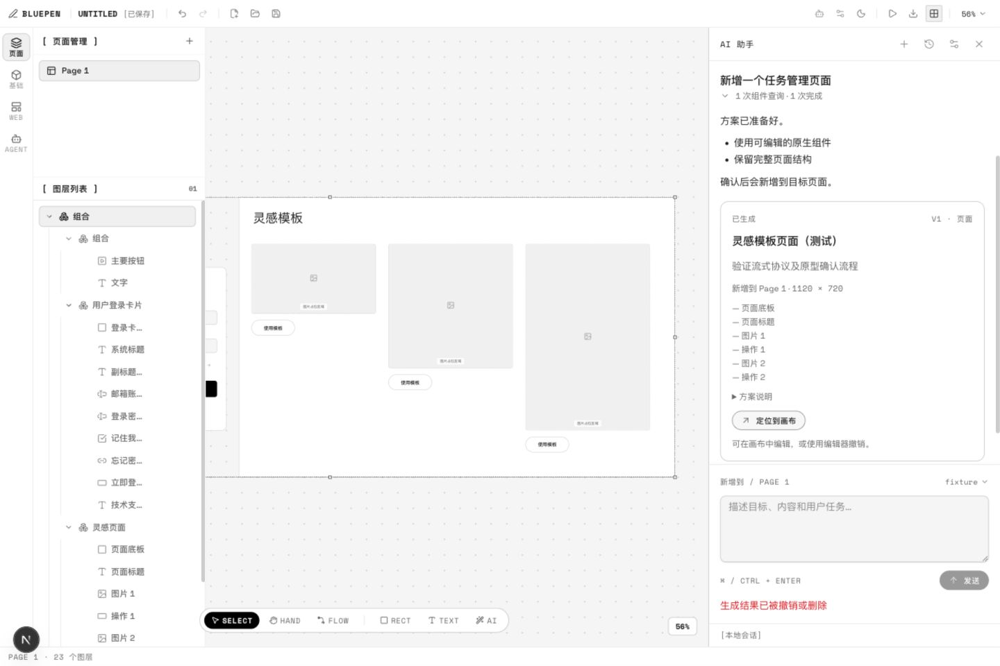

# Bluepen Agent 体验重新评估与改进方案

日期：2026-09-11。评估对象：当前工作区，包含开始本轮前已经存在的未提交 Agent 实现。外部产品所写的「loverart」按 Lovart 理解。

本轮交付为评估、组件调研和可实施方案；产品代码保持原状。旧的 [改造计划](agent-experience-plan.md) 明确把「修改已有图层」放在范围外，本次需求需要扩展这一能力边界，不能沿用旧调研中「没有会话历史」等已经过时的结论。

评估完成条件：核对当前实现与实际界面；覆盖单组件、多组件、组件组和模板；找到主流程断点；以官方资料比较产品内 AI 与可复用组件；给出实现边界、优先级和验收场景。

## 1. 核心判断

**现有会话基础可以保留，下一阶段的中心应是「围绕原型对象协作」。** 当前助手能讨论、规划并新增原型，但没有把画布选择带入会话的协议，也没有修改已有对象的执行能力。用户已经选中了按钮，再说「把这个改一下」，助手仍然无法知道和操作「这个」。

目标体验是：**选中对象 → 添加到会话 → 说明修改 → 原对象发生可控变化 → 看见结果、撤销或继续调整。** 对话、引用和结果始终围绕同一批可编辑对象，不需要每轮重新描述页面。

Lovart 官方确认画布对象可以成为输入框引用，也支持 `@`；Canva 的 Ask Canva 从选中的元素或页面发起；Figma Make 的新界面允许多个对象注释累积后一起提交。值得借鉴的是这些交互与作品的关系。Lovart 的部分编辑会生成新图像资产，而 Bluepen 是结构化原型编辑器，应默认修改已有节点，并把「生成变体」做成明确的另一个动作。来源：[Lovart Chat Tools](https://www.lovart.ai/docs/how-to-prompt/chat-tools)、[Lovart 工作方式](https://www.lovart.ai/docs/getting-started/how-lovart-works)、[Ask Canva](https://www.canva.com/en_au/help/edit-designs-with-ask-canva/)、[Figma Make 编辑](https://help.figma.com/hc/en-us/articles/42009840449175-Edit-a-Figma-Make-file)。

外部产品依据来自当日官方资料，未登录实测其模型效果或速度。完整组件、许可和版本研究见 [产品型 AI 与组件调研](agent-product-patterns-2026-09-11.md)。

## 2. 当前实现：已经具备什么

| 能力 | 本轮核实的现状 | 判断 |
| --- | --- | --- |
| 直接打开助手 | 顶栏和画布工具栏均可打开；面板宽度可调 | 保留入口与面板，不另建独立聊天工作台 |
| 会话与恢复 | 已有新建、切换、重命名、搜索、归档、删除、草稿和本地历史；按项目身份隔离 | 已是可复用基础。实际切换会话可用，持久化等本轮由专项回归覆盖 |
| 请求生命周期 | 用户消息立即入列；有真实工具状态、流式正文、停止、失败重试；收起面板不结束运行 | 保留控制器与运行时；继续改善面向设计任务的表达 |
| 人机协作 | 有结构化问题、必答校验、继续任务，以及方案确认/拒绝 | 保留；局部修改不必强制套用完整页面的确认流程 |
| 结果闭环 | 确认后新增可编辑对象，面板保留，有定位入口，接入编辑器撤销 | 已经连通，但当前状态与定位存在下述问题 |
| 设置与凭据 | 设置独立；桌面凭据与 Web 会话凭据分开；连接测试覆盖工具与结构化输出 | 保留。本轮只使用隔离的本地模拟服务，没有读取或调用真实用户 Key |
| 画布结构 | 原生支持多选、嵌套 children、parentId、组合、锁定、批量属性更新及历史快照 | 能支撑对象定向编辑，无需重建画布 |
| 模板 | 业务模板经工厂实例化为包含原子组件的 group | 已放入画布的模板可按真实子树编辑；库条目可另作参考来源 |

依据：[AgentController](../packages/editor/src/components/editor/agent/agent-controller.ts)、[AgentPanel](../packages/editor/src/components/editor/agent/agent-panel.tsx)、[运行时](../packages/editor/src/components/editor/agent/agent-runtime.ts)、[对象类型](../packages/editor/src/components/editor/types.ts)、[模板工厂](../packages/editor/src/components/editor/library/block-templates.ts)、[编辑器调用方](../packages/editor/src/components/editor/editor.tsx)。

## 3. 当前主流程的断点

这里的 P0 表示本次目标的前置能力，不表示生产事故等级。

| 优先级 | 发现与证据 | 用户受到的影响 | 改进方向 |
| --- | --- | --- | --- |
| P0 | 单选、多选、组和模板实例都没有「添加到会话」入口；输入区始终为「新增到 / Page 1」。截图 02–04 | 无法明确告诉 AI 修改谁 | 统一选择引用入口，发送前展示实际目标 |
| P0 | `AgentContext` 只有 projectId、pageId、pageName、anchor；运行时唯一工具是 searchComponents，提示词明确只规划新增 | 附上名称或截图也无法直接修改节点 | 加入稳定引用、结构化读取、受范围约束的变更协议 |
| P0 | `prepareAgentArtifact` 返回原根列表加一个新根；`planToElement` 创建新 ID，没有已有节点补丁 | 「修改按钮」只能变成重新生成，破坏用户已有编辑关系 | 原地修改保留 ID，新增节点才分配 ID；模板实例复用现有工厂/子树 |
| P1 | 确认方案前只有名称、说明、尺寸、子项列表，没有结果预览。截图 06 | 用户很难判断布局是否符合预期 | 在临时文档中渲染结果；较大改动提供前后对比和影响范围 |
| P1 | 本轮生成后，结果大部分落在可视区域外；再次点定位才完整显示。截图 07 与 09 | 显示成功后还得自己找结果 | 生成后基于刚提交的目标计算视图；核对 React 提交与 fitContent 的调用时机 |
| P1 | 撤销生成，画布从 22 个图层回到 13 个，卡片仍显示「已生成」；点击才报结果已撤销或删除。截图 08 | 会话中的当前状态不可信；继续讨论可能沿用过期结果 | 保留历史动作，另显示对象当前状态；下一轮重新读取实际目标 |
| P1 | 将生成结果与其他对象编组后，图层仍存在，定位却报已删除；切换会话清除旧错误后再点击仍复现。截图 11 | 用户正常编组就破坏会话到原型的连接 | 按 ID 遍历页面完整对象树，解析祖先和绝对边界；不只查页面根节点 |
| P1 | 用户消息无编辑入口；成功回复无重新生成；重试仅针对最后一条失败/停止/中断回复 | 基础纠错与迭代操作不足 | 增加编辑并重发、成功回复重生成；定义它们与已经应用结果的关系 |
| P1 | 普通 textarea，没有对象条、参考图片附件和 `@` 搜索；空态建议全是新增页面 | 用户难以从现有作品开始协作 | 先对象条，再截图粘贴/拖入和 `@` 搜索；建议随对象种类变化 |
| P2 | 打开 AI 后属性面板隐藏；窄于 lg 时连左侧栏也隐藏；本轮 728px 视口的底部工具栏左端被裁切。截图 05 | 手工调整与 AI 迭代之间需要频繁切换 | 保留容易到达的「属性 / AI」切换；窄窗提供可恢复的图层/组件入口与可容纳工具栏 |

关键代码位置：

- [agent-types.ts](../packages/editor/src/components/editor/agent/agent-types.ts) 6–11 行：当前上下文没有对象引用。
- [agent-runtime.ts](../packages/editor/src/components/editor/agent/agent-runtime.ts) 48–69 行：新增规划边界与唯一目录检索工具。
- [agent-canvas.ts](../packages/editor/src/components/editor/agent/agent-canvas.ts) 6–22 行：根节点查找、新增以及应用去重。
- [editor.tsx](../packages/editor/src/components/editor/editor.tsx) 701–708 行：生成提交与视图调整；1958–1970 行：传入上下文及仅对 page.elements 做 some 的定位检查。
- [agent-message.tsx](../packages/editor/src/components/editor/agent/agent-message.tsx) 70–86 行：结果卡片、已生成标记及消息操作。
- [agent-controller.ts](../packages/editor/src/components/editor/agent/agent-controller.ts) 131–137 行：下一轮模型历史使用 message.applied 判断「已生成」，不会检查当前画布。

生成后首次视图问题的调用时机是源码支持的原因推断，尚未通过修改对照实验确定；「首次结果未完整可见、再次定位后可见」是本轮实测。其余列明的定位和状态问题有当前界面与代码相互印证。

## 4. 建议的对象协作流程

### 4.1 添加入口与引用语义

画布浮动操作条、右键菜单和图层菜单统一提供「添加到 AI 会话」。保留原有单击选择、拖动和编组行为，不把每次选择都自动加入会话。入口负责打开当前项目会话、保留已有文字草稿、追加引用并聚焦输入框。重复添加同一对象去重。

组件/模板库增加「作为参考添加」；无需先把参考模板放到画布。输入框上方用紧凑对象条展示：名称、类型或缩略图、数量、用途、移除和定位。名称相同的对象显示所属页面及组路径。

| 对象来源 | 默认用途 | 本轮含义 |
| --- | --- | --- |
| 画布单个组件 | 修改目标 | 修改这个实例；保留 ID、现有属性和关联关系 |
| 多个组件 | 多个修改目标 | 一条引用集合，可展开成员；不会为了交给 AI 自动创建永久组 |
| 组件组/容器 | 修改目标 | 组及其后代构成目标范围；组与后代重复选择时去重 |
| 画布上的模板实例 | 修改目标 | 修改这一个实例的真实子树；其他副本不连带改变 |
| 组件库/模板库条目 | 参考 | 参考定义的类型和结构；按要求创建实例或改造已有目标 |
| 外部截图/图片 | 参考 | 提供视觉方向，不因为附图就扩展已有对象的修改范围 |
| 页面 | 页面级目标 | 明确显示整页范围；不默认获得其他页面的写入范围 |

例如：选中「登录卡片」→ 添加到会话 → 输入「改成手机号验证码登录，保留卡片尺寸」→ 修改该实例中的字段与按钮 → 结果显示「已修改登录卡片」并高亮。再输入「按钮文案再简短一点」时，输入区可见地沿用这个对象。用户另选一个对象不会悄悄改写草稿、历史或正在执行的目标。

多组件任务例如「把这三个卡片改成横向排列，统一间距」；模板参考任务例如「参考这个表单模板，调整选中的设置面板」。后一种在输入框同时显示「修改：设置面板」和「参考：表单模板」。

### 4.2 发送时冻结什么，执行前检查什么

引用需要保存来源类型、用途、稳定项目/页面/对象 ID、显示名称、祖先路径，以及发送时快照。模板库引用使用稳定类型标识；不能用中文名称猜测其身份。当前模板实例是通用 group，先按实际树工作，不强行假定它拥有源模板元数据。

发送时形成该轮的明确目标集合，并读取结构化属性、组层级、布局约束及必要的周边信息。父容器的布局可供理解，但不因此成为可任意修改的目标。用户点击其他页面、选中其他组件、收起面板，都不改变这次请求的范围。

提交前重新解析目标 ID，比较实际读取和将要修改的字段及依赖。目标被删除、改名以外的相关结构改变、编组位置或父布局变化，应正确重算或提示冲突；目标之外无关内容发生修改，不应仅因整页版本变化而一律阻止任务。首版写入限于单个明确页面，跨页参考保持可见，跨页写入另行明确目标。

大型组分层读取并显示范围；达到上限时要求缩小范围或选择处理批次，不能静默截掉后半组后仍声称处理完毕。具体节点/图像数量和大小上限需用真实项目验证，不照搬 Lovart 的 10 个引用限制。

### 4.3 直接修改与预览如何分工

| 用户意图 | 建议行为 |
| --- | --- |
| 讨论、解释、给建议 | 回复及必要澄清；不创建变更 |
| 明确目标的文案、样式、间距等局部可逆修改 | 发送后执行，验证通过后一次应用；展示修改摘要和撤销入口 |
| 整页重排、较大结构替换、删除内容、影响目标外布局 | 先显示预览与完整影响范围，一次确认后应用 |
| 要求探索多个版本 | 明确「生成变体」，保留原对象，在旁边创建新实例 |
| 没有可解析目标，却说「改这个」 | 就地要求补充对象，不默认新增整页或猜测目标 |

这是建议的产品规则，尚未实施。简单修改不重复要求用户批准已经写清楚的操作；复杂任务的确认应针对可以看见的具体结果。

预览使用副本/临时文档渲染，未采用前不修改真实画布。模型流式输出未完成的 JSON 不能逐段写入真实对象。结果仍由现有组件渲染器呈现，文字、表格、按钮保持可编辑。

### 4.4 结果、手工编辑和撤销

结果卡以作品变化为主体，例如「已调整 3 个卡片：横向排列，间距 24」，附目标、缩略图或对比、定位、继续调整和撤销。目录查询次数和耗时放在可折叠详情中；不展示没有真实来源的推理过程或百分比。

一轮变更关联唯一事务，包含操作前后必要数据、目标和新建节点 ID。正常编组后仍通过树中的 ID 定位；撤销、重做、删除、移到其他组后更新对象当前状态。历史中的「当时已生成」仍保留，但卡片需要另示「当前已撤销」「当前已被手工调整」等事实。

「撤销本次」不能直接等价于全局 undo：如果用户随后改了别的内容，应只回退该事务仍可安全回退的字段；同一字段已被手工修改时，说明冲突并保留当前内容。最小实现可只允许撤销位于历史栈顶的该事务，其他情况下明确引导到历史，而不冒充精确撤销。推荐在支持定向修改的版本内补上带条件校验的逆向操作。

运行被停止时未提交变更全部丢弃；已经成功提交的结果如实记录。重试使用事务去重，不重复新增、重复应用，不能因重放消息再次执行历史操作。

## 5. 基础会话体验补齐

| 部分 | 建议 |
| --- | --- |
| 输入 | 对象条与草稿一起保存；支持粘贴/拖入参考截图、移除/预览、格式与大小错误；保留 Ctrl/Cmd+Enter 与中文输入法保护。`@` 选择页内对象、组和库条目，支持名称搜索 |
| 消息操作 | 复制用户/助手消息；编辑并重发；成功回复重新生成；失败重试。首版可限制编辑最后一条用户消息，保留旧轮记录。已应用的原型不会因为编辑对话而自动回滚 |
| 上下文建议 | 无目标时建议新建；文字建议改文案，卡片组建议布局/统一样式，模板实例建议调整字段。建议只调用已经支持的动作 |
| 等待输入 | 可在问题卡回答，也能明确取消澄清返回自由输入；保留草稿。不要让用户在已经知道怎么改时只能填写不相关表单 |
| 运行反馈 | 紧凑显示「读取选中内容 / 调整布局 / 验证修改 / 已应用」。这些状态来自实际执行阶段；长任务可停止，停止和撤销分开 |
| 结果 | 先呈现对象和变化，再呈现解释。生成之后保留输入区中的目标关系，可以马上继续迭代 |
| 历史 | 沿用现有本地会话管理；恢复时同步解析对象是否仍存在。长历史需要上下文预算与摘要策略，旧版本变更不能每次全部重发 |
| 版面 | 沿用右侧助手与现有图层/组件库；提供可达的属性切换，切换时不丢草稿/目标/运行。在窄窗处理工具栏裁切和左侧入口消失 |
| 可访问性 | 添加引用后聚焦输入框，移除引用后焦点有归属；对象条可用键盘展开和定位；新状态简短播报，完整流式正文不反复朗读；明确错误对应哪条消息 |

设计继续使用项目 Nothing 体系：正文/UI 用 Space Grotesk，数据与状态用 Space Mono，当前由 `next/font/google` 加载，中文沿用现有系统回退。聊天面板没有需要 Doto 的大字号展示场景。深浅主题都覆盖；三层层级是当前任务与结果、回复与补充操作、模型/时间/过程元信息。沿用 coss/Base UI 与现有 tokens，避免额外全局主题、阴影、渐变、Toast 和装饰动效。依据：[项目设计技能](../.agents/skills/nothing-design/SKILL.md)、[字体加载](../apps/app/src/app/layout.tsx)。

## 6. 组件选择：有成熟方案，建议有边界地采用

**优先验证 assistant-ui 的 ExternalStoreRuntime + Base UI 外观。** 官方支持由现有状态管理器提供消息和回调，因此可让 AgentController 继续拥有会话、运行和存储；附件还支持从描述对象创建引用，不必伪造文件或上传对象。来源：[ExternalStoreRuntime](https://www.assistant-ui.com/docs/runtimes/custom/external-store)、[Attachments](https://www.assistant-ui.com/docs/guides/attachments)。

| 候选 | 本项目定位 | 取舍 |
| --- | --- | --- |
| assistant-ui | 优先试接输入、对象附件外观、消息操作与时间线 | 现有控制器接适配层，画布动作由 Bluepen 执行。Base UI 外观不代表核心包完全没有 Radix 依赖；实际依赖、体积和行为需要验证 |
| AI Elements / Streamdown | 按部件采用的备选，尤其流式 Markdown、消息和滚动 | 适合保留当前结构逐项补齐；AI Elements 当日源码仍有 SDK 6 依赖，当前项目已是 AI SDK 7，需检查具体类型 |
| CopilotKit | 参考产品内上下文与前端工具协议 | 有成熟平台能力，但本轮为了聊天界面迁移既有运行协议和存储，成本过高 |
| Ant Design X | 参考结构化输入和消息交互 | 整套 UI 引入 antd，与现有 Base UI/Nothing 的适配成本高 |
| Beautiful UI | 参考状态卡、上下文卡和选择动作外观 | 延续已有研究价值；界面示例不替代运行、修改与恢复逻辑 |

具体 API、MIT/Apache 许可、发布活动、版本差异和出处均在 [组件调研第 5–7 节](agent-product-patterns-2026-09-11.md)。本轮没有安装组件，因此「推荐候选」不等于「已验证可无缝替换」。

试接必须保持单一业务状态来源：assistant-ui 读取控制器状态，回调返回控制器；不再建立一份会话、草稿、审批或运行状态。问题卡、变更卡、结果卡保持结构化内容，不能转换成纯文本后丢失状态。首版对象条可以配合普通输入框；成熟库的 `@` 原子标签若需要不稳定 API 或 Lexical，应隔离接入，不能阻塞对象编辑主链。

## 7. 实现落点与实施顺序

### 7.1 沿用的边界

| 层 | 主要职责 | 当前接点 |
| --- | --- | --- |
| 引用与读取 | 解析目标、祖先与模板参考，生成实际发送快照 | editor.selectedIds、对象树、[getTopLevelSelectedElements](../packages/editor/src/components/editor/utils/clipboard.ts)、模板工厂 |
| 会话与运行 | 保存引用草稿和轮次目标，管理等待、停止、错误与重试 | AgentController、AgentSession、ConversationMessage、AgentStorage |
| AI 运行时 | 读取有限目标、检索目录、返回受 schema 约束的修改建议 | responsesAgentProvider、现有 AI SDK 7 与 Responses/Tauri 传输 |
| 变更执行 | 校验范围、属性和版本，预览，一次提交，记录结果和逆向操作 | [patchElements](../packages/editor/src/components/editor/utils/element-updates.ts)、commitBatchUpdateElements、[编辑历史](../packages/editor/src/components/editor/utils/history.ts) |
| 会话 UI | 对象条、正文、真实运行反馈、问题、变更/结果卡 | AgentPanel、AgentMessageView、可选 assistant-ui 适配 |

建议扩展「读取目标 / 按 ID 读取必要节点 / 查询组件 / 提交修改建议」这些能力，返回结构化字段修改、节点插入/移除/移动。模型不直接操作 DOM，也不返回任意 JS。最终写入统一经过编辑器验证和提交，避免出现与手工编辑平行的另一份原型。

属性合并必须保留模型没有修改的 props；当前 patchElements 是对节点字段的浅合并，不能把只含一个属性的 props 对象直接覆盖完整 props。锁定及祖先锁定、旋转、相对坐标、autoLayout、连接线 ID 与交互关联要一起纳入范围检查。选择组时保留既有层级；父布局会联动兄弟对象时，预览需要列出实际影响，不只列模型显式修改的节点。

缩略图和对比应该使用实际组件渲染结果。当前 exportPng 的文字分支绘制的是灰色条纹，而不是实际文字，因此不能直接把这个导出结果当成可靠的模型视觉上下文或前后对比，需要单独验证渲染方案。依据：[editor.tsx 的 exportPng](../packages/editor/src/components/editor/editor.tsx) 1504 行起。

### 7.2 建议按三个交付阶段推进

1. **打通对象编辑闭环。** 引用模型、统一添加入口、对象条、有限结构读取、原地修改与一次提交；同时覆盖单组件、多组件、组、模板实例和库模板参考。修正嵌套定位与撤销后的结果状态。先用确定性响应验证范围和事务，再验证真实模型。
2. **补齐预览和基础会话操作。** 变更预览/对比、精确撤销、图片参考、编辑重发、成功重生成、`@` 查找与消息状态呈现。assistant-ui 先做隔离试接，以保留既有行为和实际减少维护工作为采用条件。
3. **完善规模与工作流。** 长历史预算、大型组分层读取、多对象各自的局部指令、窄窗与键盘体验；验证深浅主题、实际 Tauri 静态生产构建与重启恢复。

不要把第一阶段拆成「先显示引用标签、下一版才能修改」。用户的四类对象应在同一可交付阶段完成添加、读取、修改、定位与撤销这条链。

## 8. 验收场景

| 编号 | 场景 | 成功标准 |
| --- | --- | --- |
| A01 | 选中一个按钮，要求修改文案 | 原 ID 保留；只改变目标字段；名称相同的其他按钮不变 |
| A02 | 选中多个组件，要求统一间距 | 引用成员明确；按现有父坐标系正确调整；不擅自永久编组 |
| A03 | 选中父组和其中子节点 | 范围去重；每个节点只修改一次；层级保持有效 |
| A04 | 选中嵌套组内组件 | 可引用、修改、定位；祖先锁定有效；不会误报已删除 |
| A05 | 选择已放入画布的模板 | 修改该实例的真实子组件；另一个实例不变 |
| A06 | 从库中附加模板作为参考 | 无需先插入画布；不改库定义；按用户要求修改目标或新建实例 |
| A07 | 发送后换选择、页面或会话 | 运行目标不漂移；结果归属原项目/页面/轮次 |
| A08 | 运行中目标被删除、重组或手工修改 | 删除准确提示；可解析的重组正确定位；冲突不覆盖用户修改 |
| A09 | 改一个组件，其余页面被手工调整 | 相关字段未冲突时仍可应用，不因无关整页变化误阻止 |
| A10 | 生成或修改后撤销、重做 | 画布与结果当前状态同步；下一轮读取当前对象事实 |
| A11 | AI 修改后再手工改其他对象，再撤销 AI 修改 | 不撤掉后续手工修改；同一字段冲突有明确提示 |
| A12 | 停止、重复点击应用或失败重试 | 半成品不入画布，已提交操作不重复，旧回调不覆盖新状态 |
| A13 | 编辑重发或成功重生成 | 保留旧轮记录，旧的已应用操作不自动重放或回滚 |
| A14 | 引用草稿重启恢复 | 草稿、引用用途与 ID 保留；失效引用就地标注，历史名称不被悄悄改写 |
| A15 | 大组、长对话、图片附件 | 实际上下文范围可解释；没有静默截断或无界复制；记录开销而不凭感觉声称流畅 |
| A16 | 键盘、中文输入法、深浅主题及窄窗 | 引用操作可达，中文确认不误发送，阅读不抢滚动，画布与工具入口可用 |
| A17 | 桌面端生产环境 | UI → 控制器 → 本地/原生传输 → 模型 → 验证 → 原对象修改 → 重启恢复真实贯通 |

## 9. 本轮验证与边界

- 基于当前代码启动独立 Web 开发预览，使用 Codex 内置浏览器；本轮新建的本地测试项目与正常工作入口隔离。检查 1440 × 960 桌面视口、默认 728 × 889 窄视口、深浅主题。
- 实际操作：打开助手、插入单组件、多选、编组、插入模板并查看子树、本地服务设置与连接测试、消息发送、方案确认、生成、撤销/重做、定位、新建/切换会话、生成对象再次编组。
- 连接与生成通过已有本地 Responses 模拟服务，运行实际应用控制器和 SDK；模拟内容与用户输入语义不匹配是测试夹具行为，不能拿它评价真实模型设计质量。
- 本轮执行现有 Agent 控制器、运行时、存储三组专项回归：**26 项通过，0 失败**。覆盖项目隔离、等待回答、停止与迟到事件、去重、传输及凭据存储等已有行为。
- 本轮未重跑完整 101 项测试、生产构建或 Rust 检查；未调用真实模型，未运行打包桌面应用，未验证外部组件实际集成，也未进行完整读屏审计。旧验证记录不能当作本轮新证据。
- 预览与模拟服务已停止，临时 Next 产物移出仓库；启动预览自动产生的 TypeScript 配置变更已恢复。原有未提交产品改动保留，没有提交或发布。

命令：

```bash
corepack pnpm --filter @bluepen/editor exec node --test \
  src/components/editor/agent/agent-controller.test.mjs \
  src/components/editor/agent/agent-runtime.test.mjs \
  src/components/editor/agent/agent-storage.test.mjs
```

## 10. 本轮截图与逐步结论

所有下列截图均在本轮采集、保存并打开核对，来自当前实际界面，不是设计稿。编号按报告阅读顺序组织。

### 01 · 打开助手：基础入口正常，建议仍只面向新增

界面已提供历史、新建和设置入口，布局遵循深色体系。用户看到的首要任务仍是生成页面；打开后的焦点停在入口控件，未来从对象加入时应直接到达输入框。



### 02 · 单个组件：缺少添加到会话入口

按钮已经选中，右键菜单提供编辑动作，但没有 AI 对象动作；右侧没有当前按钮引用。



### 03 · 多组件：选择能力正常，与 AI 上下文断开

画布明确显示「2 项已选中」，输入区仍是「新增到 / Page 1」。随后使用快捷键成功组合，助手也未形成引用。



### 04 · 模板实例与组：结构可复用，协作入口缺失

左侧能看到登录卡片的字段和按钮子节点；组边界明确，适合保留原结构做局部修改。



### 05 · 窄窗入口：画布工具条裁切，库入口需要收起助手才能恢复

截图为 728px 宽的本次默认预览。这里只判断该尺寸，不外推所有桌面分辨率均存在问题。



### 06 · 发送到方案：链路正常，缺少可视预览

本地连接测试成功，发送后用户消息立即入列，真实组件目录工具完成。方案有尺寸、内容与确认操作，但采用前只能读文字列表。



### 07 · 确认生成：成功新增，首次结果未完整进入视野

图层从 13 增至 22，卡片变为已生成，面板保留；新结果大部分位于画布可视范围之外。



### 08 · 撤销结果：画布正确回退，会话当前状态失配

图层回到 13，卡片仍为已生成；点击定位出现撤销/删除错误。当前错误放在输入区，与错误对象距离较远。



### 09 · 重做并定位：对象可完整显示，但旧错误未消失

图层恢复为 22，定位后缩放到 56%，完整结果可见。之前的错误仍留在输入区，需要随成功恢复更新。



### 10 · 浅色模式：结构正常，细小元信息仍需可读性验收

现有主题可正常切换。截图中的旧错误属于前一步的状态问题；完整对比度、200% 缩放和读屏验证尚未执行。


### 11 · 生成对象加入组：会话定位误报删除

将三个根对象组合后共有 23 个图层，左侧仍能找到「灵感页面」。新建并切回原会话清除旧错误，再点击定位，仍出现「生成结果已被撤销或删除」。稳定引用需要支持这类正常编辑动作。


