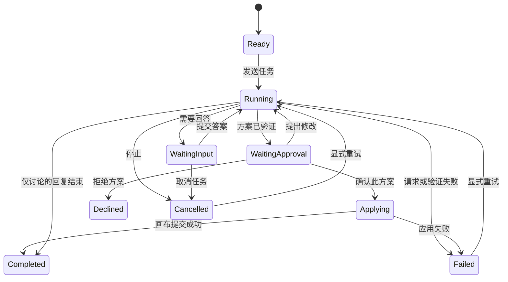

# Bluepen Agent 使用体验调研

调研日期：2026-09-10。范围：当前工作区（包含调研前已有的未提交实现）、本地浏览器入口、Beautiful UI 与主流 Agent 官方资料。本轮只形成评估与建议，不修改产品实现。

调研验收：核实实际能力与缺口；给出组件参考及适配边界；明确设置、会话、运行过程、人机交互、画布结果的完整关系；给出落地顺序与可验证的验收场景。文中“建议”均不是已实现功能。

## 1. 核心判断

目前是一个能够多轮规划并生成原型的早期助手，但缺少可持续使用的会话工作台。主要问题是会话不可管理、过程不可观察、人机交互没有结构化状态、生成结果与对话脱节。只替换聊天外观无法解决这些问题。

建议目标体验：**新建会话 → 输入任务与上下文 → 看见真实执行过程 → 必要时回答问题 → 审阅方案并生成 → 在同一会话查看结果、继续讨论 → 随时恢复历史。**

API Key、接口地址和默认模型归入独立的应用设置页面。对话输入区只保留当前模型选择和简短连接状态。

## 2. 当前能力与体验缺口

| 领域 | 核实到的现状 | 用户影响与建议 |
| --- | --- | --- |
| 入口 | 工具栏 AI 按钮先进入画布放置工具，再点击画布打开助手 | 讨论也必须先找落点；新增直接打开助手的入口，保留“在此处生成”作为画布动作 |
| 消息流 | `messages` 保存多轮纯文本，但 UI 只渲染用户消息；助手只显示最新的 `reply`，并置于用户历史上方 | 不能按时间阅读完整对话；改为用户、助手、过程、问题、方案、结果按轮次排列 |
| 发送反馈 | 用户消息在请求成功后才加入 `messages`；发送时清空输入，失败再恢复 | 请求期间看不到刚发出的完整消息；发送立即入列，标记失败或已停止，支持重试 |
| 历史会话 | React 内存状态，无会话 ID、标题、新建、列表或持久化 | 同次挂载隐藏面板通常保留消息，但刷新/重启丢失；新建和恢复必须成为基础功能 |
| 执行过程 | 已用 AI SDK Responses 流式输出；真实 `searchComponents` 工具，最多 5 步；UI 仅接收 `partial.reply` | 搜索、工具结果、验证等过程不透明；增加真实运行事件，而非固定动画假装执行 |
| 思考 | 没有向 UI 转发 reasoning 事件 | 可显示真实状态与简要进展；模型未提供可展示的推理摘要时，不伪造“思考内容” |
| Ask human | 系统提示词要求需求不清时用文本提问、`plan=null` | 有文字澄清能力，但没有问题 ID、选项、待回答状态及结构化恢复 |
| 确认 | 方案卡“按此方案生成”是实际写入画布的入口 | 已有有价值的确认边界；补充方案版本、目标、修改摘要和已应用状态 |
| 生成闭环 | `generatePrototype` 验证后通过 `commit` 添加可编辑组合，选中结果并适应视图，然后关闭面板 | 已有撤销历史接点，但对话不记录生成结果；成功后保留会话，提供定位及继续讨论入口 |
| 取消/错误 | 支持 AbortController、取消、超时与多种接口错误中文提示；关闭运行中面板会取消 | 基础错误处理应保留；明确区分“收起面板”和“停止运行”，把停止/失败保留在时间线 |
| 项目与页面 | AgentPanel 未接收 project/page/selection；旧方案与消息不随 `loadProject` 重置 | 旧方案可能落到当前新页面；会话必须绑定项目，运行与方案绑定明确目标页面和版本 |
| 配置 | Base URL、Key、模型在聊天底部 BYOK 折叠区，每次输入写入 localStorage | 配置打断对话；移入设置页，显式保存、验证连接、清楚显示错误 |
| 凭据 | Key 与普通配置一起以明文存于 localStorage；现有 Rust 插件没有凭据库 | 桌面凭据单独接入安全存储；项目文件、历史记录、诊断导出不包含 Key |
| 面板布局 | 固定 380px，absolute 定位覆盖编辑器右侧 | 对比画布与过程不便；建议占据布局空间、可调宽度，历史在面板内部切换 |

特别区分：`library/agent-components.ts` 与 `agent-renderers.tsx` 是用户用于绘制 Agent 产品原型的素材；它们包含思考/工具等外观，不代表 Bluepen 自身助手已接入对应能力。

也不要将 `showToast` 的函数名误判为当前仍有 Toast 弹窗：其实现已转为编辑器状态栏通知。需要补充的是会话内持久的结果记录。

代码证据：

- [助手面板](../packages/editor/src/components/editor/agent/agent-panel.tsx)：消息、配置、发送、取消与渲染。
- [Agent 运行时](../packages/editor/src/components/editor/agent/agent-runtime.ts)：工具循环、结构化输出、流与错误处理。
- [编辑器调用方](../packages/editor/src/components/editor/editor.tsx)：`generatePrototype`、`loadProject`、`getProject` 和 `AgentPanel`。
- [本地存储](../packages/editor/src/components/editor/hooks/local-store.ts)：现有桌面存储、IndexedDB 与项目格式；尚无聊天记录存储。
- [通知实现](../packages/editor/src/components/editor/hooks/use-toast.ts)、[顶栏](../packages/editor/src/components/editor/top-bar.tsx)、[运行时测试](../packages/editor/src/components/editor/agent/agent-runtime.test.mjs)。

## 3. Beautiful UI 应该借鉴什么

已读取[官网](https://www.beautifului.dev/)，并在浏览器核查 Approval Card 与 View code。它提供 React 源码与 shadcn registry 安装方式；Approval Card 依赖其 Button、GlideMenu，并要求全局基础样式。它是可复用的交互参考，不能视为已接好运行时的 Agent 系统。

| 参考组件 | Bluepen 中的对应体验 | 优先级与适配方式 |
| --- | --- | --- |
| [Thinking](https://www.beautifului.dev/#thinking-state) | 当前阶段、耗时、可折叠的进展摘要 | 核心；仅显示实际事件/模型提供的可展示摘要 |
| [Tool Chips](https://www.beautifului.dev/#tool-chips) | “查询组件 · 12 个结果”“验证方案 · 通过”等紧凑记录 | 核心；详细输入输出折叠，避免大段 JSON 占满消息区 |
| [Task Rows](https://www.beautifului.dev/#task-rows) | 确实存在多步骤时展示进行中、完成、失败 | 核心；短任务不强行生成任务清单，不显示无依据百分比 |
| [Approval Card](https://www.beautifului.dev/#approval-card) | 澄清问题、单选/多选、自定义输入 | 核心；官网示例实际上以问答为主，不应把所有问题都当成授权审批 |
| [Streaming Text](https://www.beautifului.dev/#streaming-text) | 按轮流式回复、格式化内容、后续动作 | 核心；用户向上阅读时不抢滚动，提供“回到最新” |
| [Chat](https://www.beautifului.dev/#chat-composer) / [Sidebar Nav](https://www.beautifului.dev/#sidebar-nav) | 当前会话、会话切换与历史列表 | 借鉴结构；Bluepen 已有图层侧栏，不另加一条永久的聊天大侧栏 |
| [Prompt Bar](https://www.beautifului.dev/#prompt-bar) | 输入框、当前模型、上下文、发送/停止 | 先做必要部分；语音、斜杠命令不是第一阶段要求 |
| [Context Cards](https://www.beautifului.dev/#context-cards) | 当前页面/选中对象/参考材料 | 只显示实际送入模型的上下文，不能只做装饰标签 |
| [Diff Table](https://www.beautifului.dev/#diff-table) | 未来修改现有画布时的前后变化 | 后续；当前以新增原型为主，先显示生成目标和内容摘要 |

[MIT 许可](https://www.beautifului.dev/license)允许使用与修改，复制实质代码需保留版权和许可声明。本次未安装任何组件。

适配原则：沿用项目 coss/Base UI、已有 tokens 与 nothing-design；不要直接覆盖 `globals.css`，也不要为了一个参考组件引入第二套全局设计系统。去掉不符合本项目的 shimmer、模糊、阴影、装饰性彩色与弹簧动画。

字体沿用现有 `next/font/google` 加载的 Space Grotesk（正文/UI）与 Space Mono（状态、耗时、标签）；中文使用已配置的系统字体回退。当前布局没有加载 Doto，聊天面板也不需要为小字号状态额外引入它。正式设计需同时覆盖深浅主题，本轮不选择单一主题或交付视觉稿。

### 主流产品与 SDK 的官方依据

| 对标对象 | 官方资料确认的模式 | Bluepen 的取舍 |
| --- | --- | --- |
| [Cursor：API Keys](https://cursor.com/help/models-and-usage/api-keys) | 在 Settings > Models 配置 Key，可用模型进入模型选择器 | 直接支持将凭据配置迁入设置页；不照搬其请求转发架构 |
| [Cursor：Plan Mode](https://cursor.com/docs/agent/plan-mode) | 调研、澄清问题、形成计划、审阅后执行 | 借鉴问答与计划审阅；简单生成无需额外强制“计划模式” |
| [Claude Code：桌面会话](https://code.claude.com/docs/en/desktop#manage-sessions) | 新建会话、独立历史、恢复、重命名、筛选和归档 | 会话应成为独立实体；不需要同时引入 worktree 或多 Agent 并发 |
| [Claude Code：交互控制](https://code.claude.com/docs/en/interactive-mode#general-controls) | 可以中断响应/工具执行 | 停止需真实生效，保留已完成记录，明确停止不等于撤销 |
| [AI SDK：工具交互](https://ai-sdk.dev/docs/ai-sdk-ui/chatbot-tool-usage) | 区分输入、待批准、批准响应、输出、错误与拒绝；需要批准的工具可通过响应续跑 | 工具状态与人机交互必须是运行时协议；拒绝不应等价于故障，也不表示每个工具都要审批 |
| [AI SDK：消息持久化](https://ai-sdk.dev/docs/ai-sdk-ui/chatbot-message-persistence) | 创建/加载聊天、持久化 UI 消息、消息 ID 与断开连接处理 | 保存消息与恢复运行是不同工作，不能仅依赖前端聊天 hook |
| [AI Elements：Reasoning](https://elements.ai-sdk.dev/components/reasoning) | 对模型提供的 reasoning 流支持展开、结束折叠；组件基于 shadcn/Radix | 借鉴交互行为，沿用项目的 Base UI/coss 实现；没有实际摘要时不编造 |

这些证据分别覆盖成熟产品的使用模式与 SDK 的实现能力，不意味着行业只有一种统一界面。共同的设计价值是：状态清楚、会话可恢复、用户知道何时需要介入，以及介入后能够继续原任务。

## 4. 建议的信息架构与交互

### 4.1 应用设置：AI 服务

从应用级设置入口进入独立设置视图。提供服务配置名称、API Base URL、API Key、默认模型、保存、测试连接和移除凭据。支持自定义兼容服务，不能把“OpenAI-compatible”误当成必然支持 Responses、工具调用与结构化输出。

测试连接应覆盖实际需要的能力；只验证 Key 或列出模型不足以证明能生成原型。测试可能产生少量调用费用，应在动作旁说明。错误分别指向认证、接口路径/协议、模型权限、限流、网络或输出能力。

未配置时，面板显示一句说明与“前往设置”，保留草稿。保存成功返回原会话；运行中修改全局配置只影响后续运行，本次运行保留配置快照。不要把密钥值放入快照，只保存配置引用。

迁移旧 `bluepen:ai-settings` 时先验证目标存储写入成功，再移除旧 Key；失败时不能静默丢配置。桌面端安全凭据存储与 Web 端保存策略分开设计：Web 默认会话内保存，若允许持久保存，应明确其本地存储边界。

### 4.2 会话面板与历史

顶部显示当前会话标题、新建、历史、更多、收起。历史在同一面板内切换，不挤占图层导航。第一阶段支持新建、切换、重命名、删除和重启恢复；搜索、时间分组、归档可随后补充。

新建会话从空上下文开始，保留旧会话；标题可先由首条用户消息截取，无需额外模型调用。每个会话分别保存草稿、滚动位置和模型选择。会话默认属于当前项目，切换项目不隐式带入旧会话；跨项目历史可作为后续入口。

最小版本先支持一个活动运行，无需同时运行多个 Agent。切换会话/收起面板不隐式终止运行；活动任务显示运行或待回答标记。跨项目操作时保留原运行目标，不能将迟到结果应用到新项目。

历史持久化不等于恢复任意网络流：重启后原先运行中的记录标为“已中断”，由用户重试；待回答问题/待确认方案可恢复，但继续前必须检查目标与方案是否仍有效。

### 4.3 Thinking、执行与结果

一轮内部按真实发生顺序呈现：用户需求 → 阶段状态/工具记录 → 必要的提问 → 回复/方案 → 应用结果。正文始终可读，过程默认紧凑，详情按需展开。

“思考中”只表示真实的模型工作阶段；可展示的推理摘要来自服务返回。没有摘要时显示“正在分析需求”或当前实际工具动作，不生成假的思考长文。

方案卡应显示产物类型、名称、目标页面、范围/内容摘要、方案版本，并提供“生成到画布”“继续调整”。生成后替换为“已生成”结果状态，保留“定位到画布”，不自动关闭对话。聊天中的“撤销本次生成”必须与编辑器历史正确关联，不能简单调用一次 undo 撤掉用户后来做的修改；第一阶段可保留现有编辑器撤销入口。

当前运行时只规划并新增原型，没有读取选择内容、修改既有元素的工具。“继续调整方案”可以先做；“直接改当前画布”需要单独补充上下文、变更协议和审阅机制，不能通过新文案假装支持。

### 4.4 Ask human 必须分成两种语义

| 类型 | 例子 | 用户操作与恢复 |
| --- | --- | --- |
| 需求澄清 | “这是移动端还是桌面端？” | 单选/多选/自由输入；提交后答案写入同一会话，再继续原任务 |
| 行为确认 | “将此方案添加到 Page 1？” | 显示明确目标及效果；确认、拒绝或返回修改；拒绝不应显示成系统错误 |

问题卡要有稳定 ID、必答/选答、提交中和已回答状态，防止重复提交。只有可选问题允许跳过；必答问题未回答时不能超时自动选择默认答案。用户也可取消任务。

确认绑定确切方案版本与目标，而不是授权“任何后续操作”。组件目录检索等只读步骤自动执行；沿用当前生成前确认一次的边界，不每一步都打断用户。未来覆盖/删除已有元素时再增加针对性审阅。

## 5. 建议的运行状态与技术边界

这是建议的产品状态图，不代表每个阶段都必须是一次 SDK 工具调用。Thinking、检索组件、生成结构等是 Running 中的实际子步骤。“正在等人”与“正在请求模型”必须区别显示。

保留现有 `runAgent`、schema 验证和 `planToElement` 边界，逐步扩展，不需要重写 AI 引擎：

- **运行时**：从只回调 reply 扩展为文本、工具开始/结束/失败、提问、方案等类型化事件；事件携带会话、运行和工具/问题 ID。已安装 AI SDK 的类型定义具备工具、reasoning 与 approval 状态，但具体服务兼容性仍需验证。
- **会话控制层**：管理运行状态、取消控制器、待回答、方案版本、迟到事件隔离；与面板挂载生命周期分离。
- **消息存储**：用有 ID 的结构化消息 parts 保存正文、工具、问题、方案引用和结果；不要长期把整份方案 JSON 拼进助手回复。展示历史与模型上下文可分别构建；完整消息不意味着每次无限发送全部历史。
- **存储边界**：桌面沿用本地存储能力、Web 用 IndexedDB；普通设置、密钥、会话、画布文档分开。明确存储失败提示与重试，不能把内存成功当保存成功。
- **项目身份**：虽然 `Project` 类型有 `id`，当前 `getProject` 与 `StoredProject` 主路径没有稳定项目 ID。新增项目级会话前需统一身份与旧格式迁移，不能仅凭项目名称区分两个 Untitled。
- **应用画布**：确认后返回已应用目标/元素 ID，让会话记录真实结果；同一方案应用去重，应用前验证目标页面仍存在。对过期/跨项目目标要求重新选择，禁止静默改写目的地。
- **人机交互续跑**：第一版可通过结构化回复返回问题并结束当次网络调用；用户答复触发同一会话的下一次调用，无需长期悬挂 Promise。若采用 SDK tool approval，则需完整保存并回传批准/拒绝状态；澄清回答不能仅靠审批布尔值表达。

Tauri 静态桌面构建与 Next 开发/Web 传输路径不同。引入 AI Elements/useChat 的服务端示例时，不能假设桌面存在 `/api/chat`；优先保留当前直接调用运行时的能力，再按需适配传输。

## 6. 分阶段落地与验收

| 阶段 | 交付范围 | 验收依据 |
| --- | --- | --- |
| 第一阶段：会话基础 | 项目身份、独立设置页、凭据迁移、新建/历史/完整消息流、本地恢复、生成结果留在会话 | 两个会话不串消息；两个同名项目不串历史；重启恢复；Key 不进入项目/聊天；新建与设置往返不丢草稿 |
| 第二阶段：可观察与可协作 | 真实事件流、工具状态、Thinking 摘要、结构化提问、方案确认与去重、取消/重试 | 工具失败不显示完成；等待回答时不继续生成；答案只提交一次；取消后迟到事件不改状态；重复确认不重复生成 |
| 第三阶段：画布协作增强 | 真实页面/选择上下文、修改已有原型、变化审阅、历史搜索与归档 | 删除目标页面能识别；跨项目不能误应用；变更可审阅并安全撤销；长会话仍可恢复与继续 |

额外必须覆盖：关闭面板不误取消；生成完成不自动关闭；输入法组合键不误发送；键盘能完成问题卡；流式消息不过度播报或抢滚动；401/429/网络失败给出可执行下一步；存储失败与应用重试不制造重复结果；无 reasoning 的模型能正常工作。

优先完成前两阶段作为第一轮产品升级；第三阶段扩大 Agent 操作范围，应另行界定需求。多 Agent 并行、语音输入、任意外部工具市场与复杂分支会话不作为本轮前置条件。

## 7. 调研证据与限制

已核查相关代码、直接调用方、本地存储、现有测试内容与已安装 SDK 类型；浏览器查看了本地应用的 AI 入口、空对话面板，以及 Beautiful UI 问题卡与源码入口。

本次没有发送真实模型请求、修改凭据或生成画布内容；没有重跑测试，因此不对现有分支的测试通过情况作声明。当前实际请求与取消行为的结论来自代码阅读，后续实现需单独做交互和运行时回归。外部资料代表调研时公开文档，不等同于对所有产品版本的实机验证。
